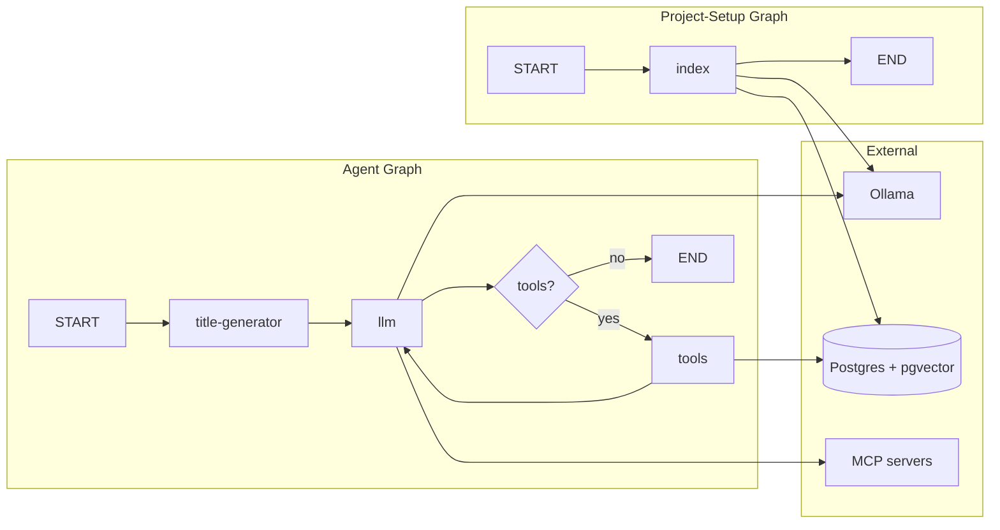

# Project Overview

The **api** app is a LangGraph-based backend that runs ReAct-style AI agents and a project-indexing pipeline. It exposes two graphs: an **agent** graph (Ollama + tools + optional MCP, with checkpointing and RAG) and a **project-setup** graph that indexes a project directory into PostgreSQL with pgvector for semantic search. It is part of the zaga-code monorepo and is intended to be run alongside the web app and Postgres (e.g. via Docker).

---

## Repository Structure

- **`src/`** – Application source.
  - **`graphs/`** – LangGraph definitions: `agent.ts` (ReAct agent), `project-setup.ts` (indexing).
  - **`nodes/`** – Graph nodes: `llm.ts` (LLM + system prompt injection), `title-generator.ts`.
  - **`tools/`** – Agent tools: `file-read`, `file-search`, `file-write`, `rag-search`, `shell`.
  - **`db/`** – Drizzle schema, pgvector init, and DB constants.
  - **`utils/`** – Shared helpers (e.g. `validate-path`, `title-generator`).
  - **`env.ts`** – Validated environment variables (Zod).
  - **`setup.ts`** – One-off setup: checkpointer tables, vector table, Ollama model pull.
- **`drizzle/`** – Migrations and Drizzle metadata.
- **`drizzle.config.ts`** – Drizzle Kit config (schema path, DB URL from env).
- **`langgraph.json`** – LangGraph CLI config: graph entrypoints and env file.

---

## Build & Development Commands

From repo root (recommended):

```bash
nvm use
pnpm install
```

From **`apps/api`** (or via `pnpm --filter api <script>`):

```bash
# Start Postgres with pgvector (from repo root)
pnpm run docker:start   # or: docker compose up -d

# Run DB migrations
pnpm run db:migrate

# One-time setup: checkpointer, vector table, Ollama models
pnpm run setup-environment

# Generate new Drizzle migrations after schema changes
pnpm run db:generate

# Start the LangGraph dev server (agent + project-setup)
pnpm run dev
```

Lint (from repo root or api):

```bash
pnpm run lint          # from root: web + api
pnpm run lint:fix      # from root: web + api
# Or from apps/api only:
pnpm run lint
pnpm run lint:fix
```

---

## Code Style & Conventions

- **TypeScript** – Strict mode, ESNext modules, path alias `@/*` → `./src/*`.
- **Formatting** – Prettier (enforced via ESLint and lint-staged at repo root).
- **Linting** – ESLint with TanStack config; run `pnpm run lint` / `lint:fix` from root or api.
- **Naming** – Files and exports: kebab-case for tools (e.g. `file-read.ts`), camelCase for functions.
- **Imports** – Prefer `@/` for app code (e.g. `@/env`, `@/tools/file-read`).
- **Env** – All required env vars are validated in `src/env.ts` with Zod; no direct `process.env` elsewhere.

---

## Architecture Notes



- **Agent graph** – ReAct loop: `title-generator` → `llm` → optional `tools` → back to `llm`. State uses `MessagesAnnotation`. Checkpointing via `PostgresSaver`; tools include file read/write/search, shell, RAG, and MCP (e.g. Context7). System prompt can be augmented with project `AGENTS.md` when `config.configurable.project_path` is set.
- **Project-setup graph** – Single node `index`: globs text files under a project path, chunks with `RecursiveCharacterTextSplitter`, embeds with Ollama, writes to `project_embeddings` (pgvector). Used to seed RAG for the agent.
- **Data flow** – Web app (or SDK) invokes graphs via LangGraph API. Agent state and checkpoints live in Postgres; RAG reads from `project_embeddings`.

---

## Testing Strategy

- **Unit / integration** – No test runner or test scripts are currently defined in `apps/api`.
- **Manual** – Run `pnpm run dev` and exercise the graphs via the LangGraph dev UI or the web app.
- **CI** – Lint is run at repo level (`pnpm run lint`). Add api-specific tests and scripts here when introduced.

> TODO: Add test framework (e.g. Vitest) and tests for tools, nodes, and graph wiring.

---

## Security & Compliance

- **Secrets** – All sensitive config (DB URL, Ollama/LangGraph URLs, model names) comes from environment variables validated in `src/env.ts`. No secrets in repo; use `.env` (gitignored) and load via `langgraph.json` or shell.
- **Path safety** – `utils/validate-path.ts` ensures file paths stay under the project root (guards against traversal); used by file-read and file-write tools.
- **Dependencies** – Standard pnpm install; no dedicated dependency-scan script in api. Run audits at monorepo level if required.
- **Licenses** – Follow repo-level policy; no extra license checks in api.

---

## Agent Guardrails

- **Files / dirs** – Agents should not modify `langgraph.json`, `drizzle.config.ts`, or `drizzle/` unless intentionally changing schema or deployment. Avoid editing `.env` or committed secrets.
- **Reviews** – Graph and tool changes (especially `shell`, file-write, and path handling) should be reviewed before merge.
- **Rate limits** – Not enforced in this app; rely on Ollama/LangGraph deployment and reverse proxy if needed.
- **Tool scope** – File and shell tools are scoped to `project_path` when provided; agents must not be given arbitrary paths outside the project.

---

## Extensibility Hooks

- **Env** – `src/env.ts`: `AGENT_MODEL`, `RAG_MODEL`, `SUMMARIZATION_MODEL`, `OLLAMA_API_URL`, `LANGGRAPH_API_URL`, `DATABASE_URL`. Add new vars there with Zod.
- **Graphs** – Register in `langgraph.json` and implement a factory (e.g. `createAgent`, `createProjectSetupGraph`). New nodes go under `src/nodes/`, new tools under `src/tools/`.
- **Tools** – Add tools to the `tools` array in `src/graphs/agent.ts`. Use `@/utils/validate-path` and `config.configurable.project_path` for path-scoped tools.
- **MCP** – `MultiServerMCPClient` in `agent.ts`; add or remove MCP servers in the client config to change agent capabilities.
- **System prompt** – Edit `SYSTEM_PROMPT` / `SYSTEM_PROMPT_WITH_AGENTS_MD` in `src/nodes/llm.ts`. Project-specific instructions are intended to come from `AGENTS.md` in the project root when `project_path` is set.

---

## Further Reading

- [LangGraph docs](https://langchain-ai.github.io/langgraph/) – Graphs, checkpoints, tools.
- [Drizzle ORM](https://orm.drizzle.team/) – Schema and migrations.
- [pgvector](https://github.com/pgvector/pgvector) – Vector column and indexes.
- Root **`AGENTS.md`** – Repo-wide agent instructions (issue tracking, landing-the-plane workflow).
- Root **`README.md`** – Monorepo setup and high-level usage.
